# Overview of NodeJS and ConEmu setup for Windows 10

Hi All, here are my suggestions for setting up your node dev environment in windows.

## Installing NodeJS

Git for windows will use your windows based [nodejs](https://nodejs.org/en/) executables. I'd suggest using the latest LTS release.

### Building native libraries

You'll need python v2.7.x (don't use v3) and a C++ compiler to install some NodeJS libraries. Here's what you need:

[Download the latest Python 2.7.x](https://www.python.org/downloads/)

[Instructions by Microsoft for installing C++ compilers](https://github.com/Microsoft/nodejs-guidelines/blob/master/windows-environment.md#compiling-native-addon-modules)

Note: I haven't had success with the npm command in Option 1. Instead use Option 2 > Option 1, this has worked for me every time: [Visual C++ Build Tools](http://go.microsoft.com/fwlink/?LinkId=691126)

## Git For Windows:

[https://git-scm.com/downloads](https://git-scm.com/downloads)

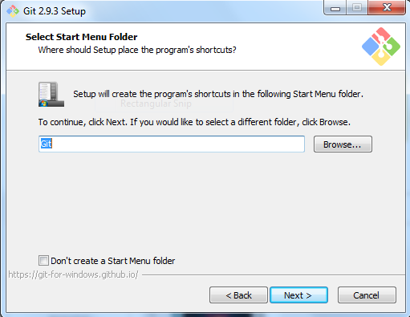

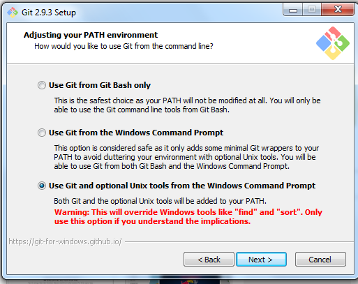

Be sure to set “Checkout as-is, commit as-is” or you’ll get weird git diffs.

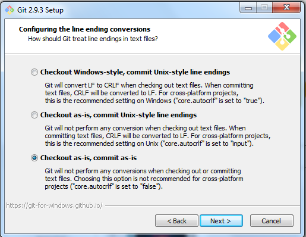

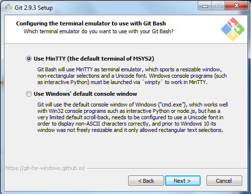

## ConEmu setup:
ConEmu is a window manager for terminals, and can manage multiple types of terminals at the same time.

[Download ConEmu Stable, Installer](https://conemu.github.io/)

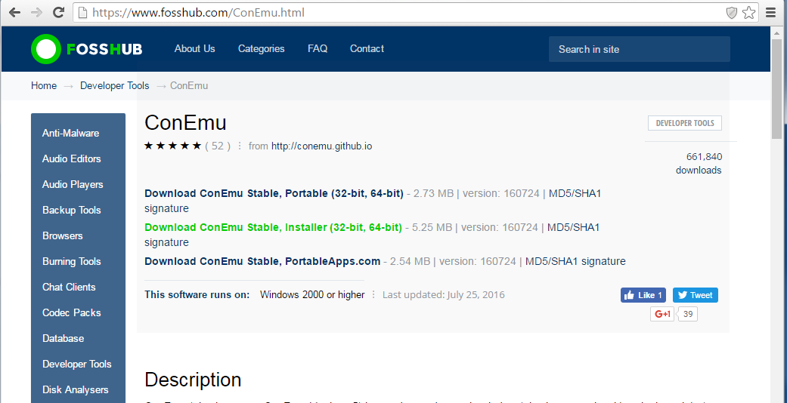

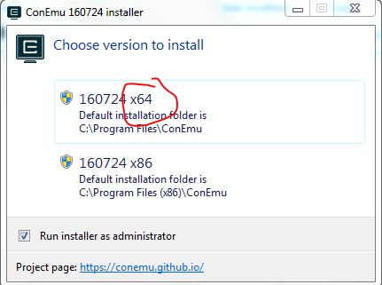

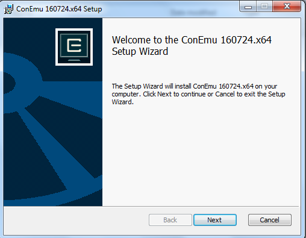

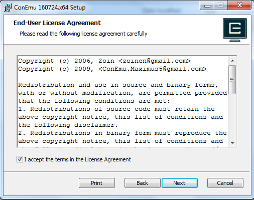

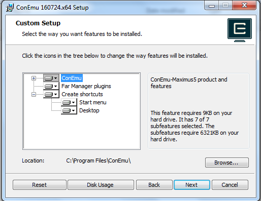

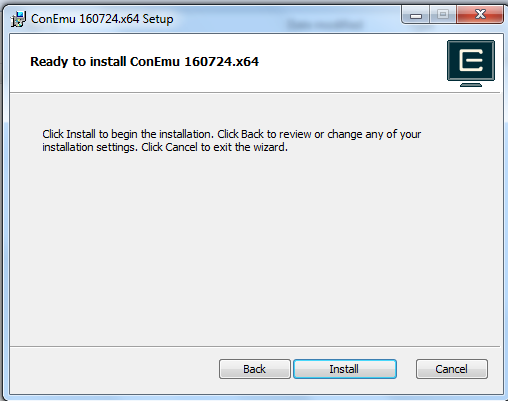

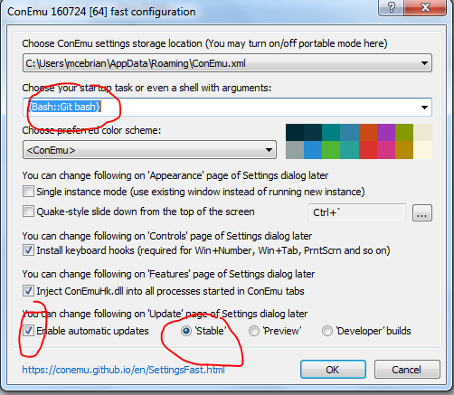


### Useful keyboard shortcuts:
Add new terminal to the right (splits view in half left/right): `ctrl + shift + e`

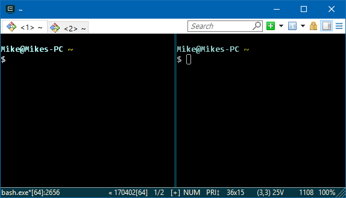

Add new terminal below (splits view in half top/bottom): `ctrl + shift + o`

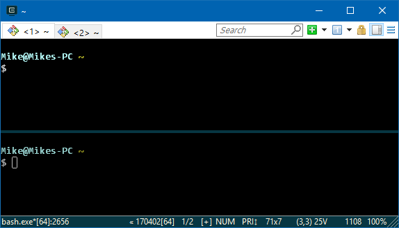

### Updating PS1:

Git-Bash prompt location: `C:\Program Files\Git\etc\profile.d\git-prompt.sh`

#### Suggestions for Git-Bash PS1:

To set tab title to current path Replace line 1 with: `PS1='\[\033]0;\w\007\]' # set window title`

Comment out line ending with `show MSYSTEM`
(Suggested) Update Font settings:

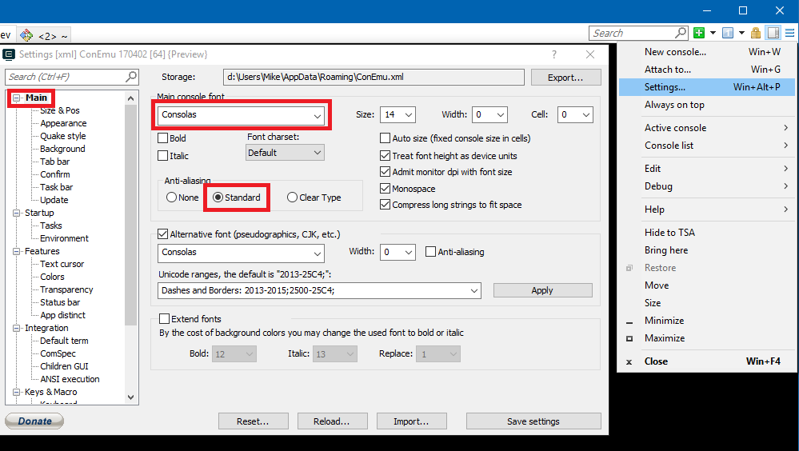

## Using ConEmu with Windows Subsystem for Linux:

### Installing WSL:
[Windows Subsystem For Linux Installation Guide](https://msdn.microsoft.com/en-us/commandline/wsl/install_guide)

Change the startup to use {Bash::bash}, if this isn’t listed then select reset at the bottom

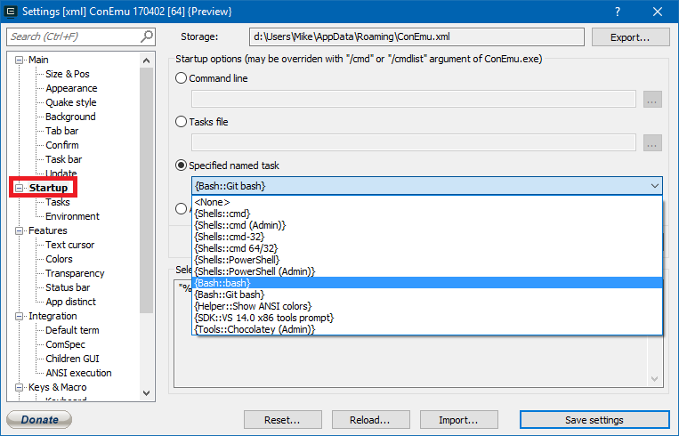

Extra details about using Windows Subsystems for Linux with ConEmu:
http://conemu.github.io/en/BashOnWindows.html
Updating PS1:
http://mediadoneright.com/content/ultimate-git-ps1-bash-prompt
Installing NodeJS on WSL:

```
sudo apt-get update
sudo apt-get install -y build-essential
curl -sL https://deb.nodesource.com/setup_6.x | sudo -E bash –
sudo apt-get install -y nodejs
```

### My suggestions:
Add the following to "various variables":

```
Space=" "
Title="\[\033]0;\w\007\]"
```

Replace exports line with: (this mimics the user@host:/path for things like scp)

```
export PS1=$Title$NewLine$BIBlue$USER@$HOSTNAME:$IYellow$PathShort$Color_Off'$(git branch &>/dev/null;\
```

[Or copy](.bash_aliases)

### FYI:
You can then open up terminals for any prompt type found by ConEmu by using the + on the top right:

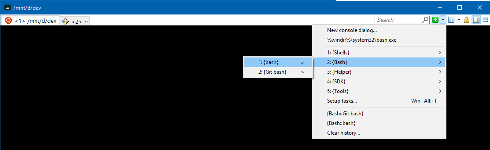